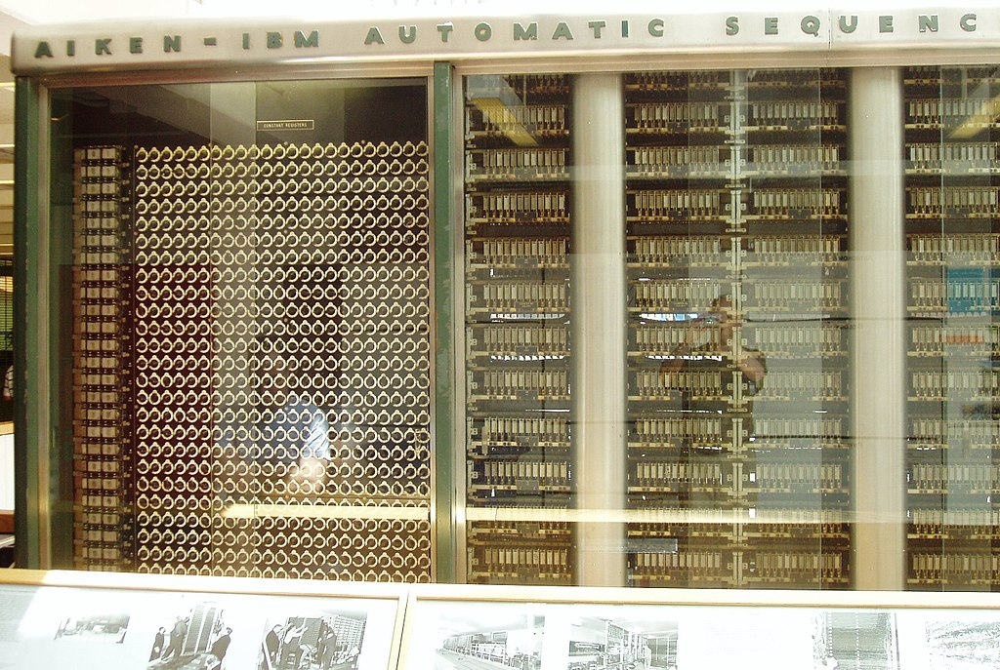
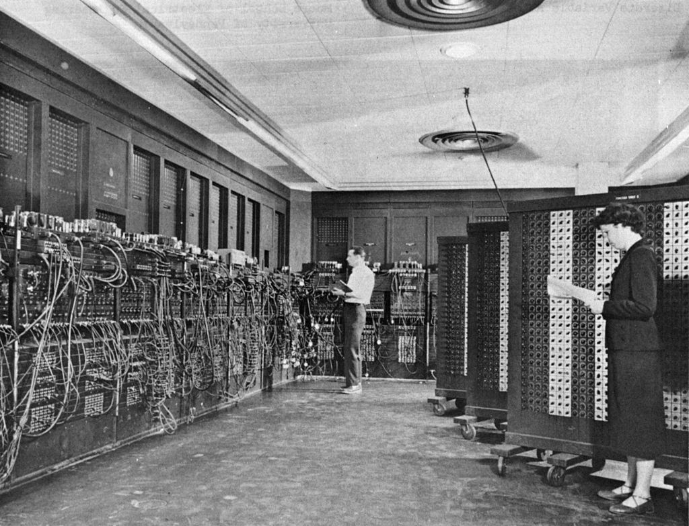
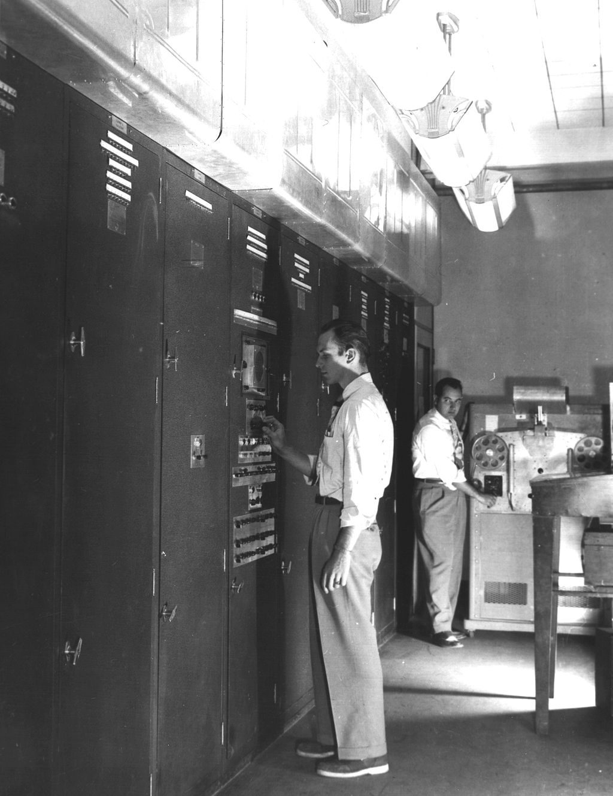
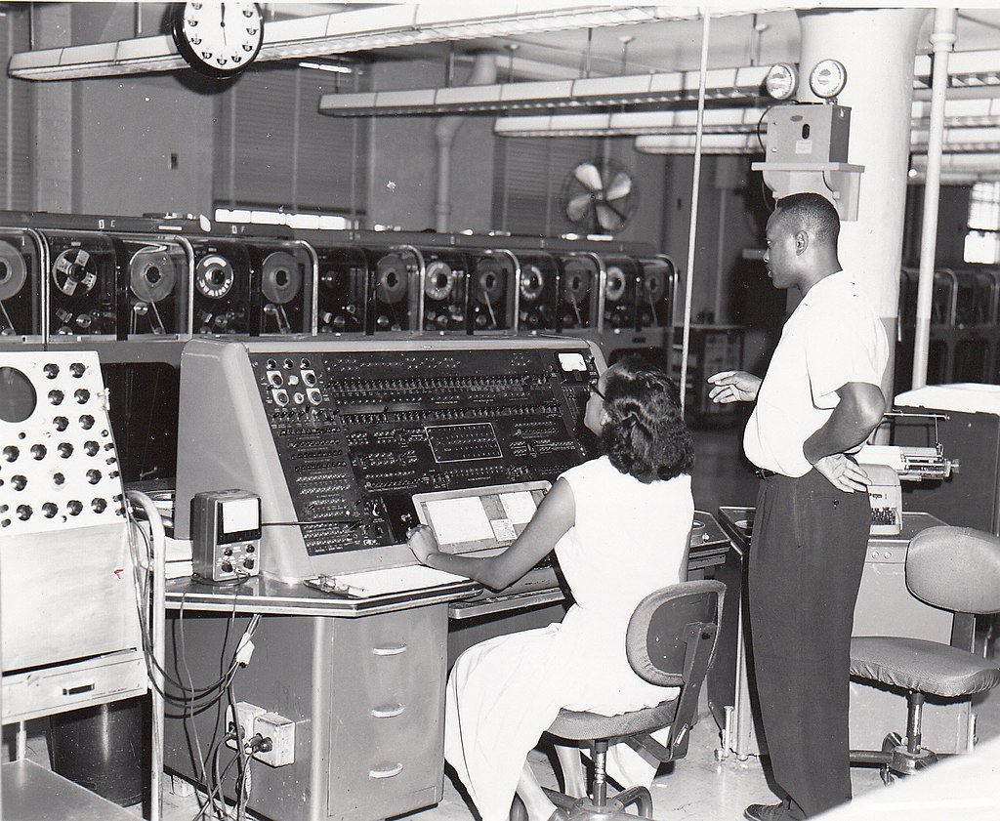
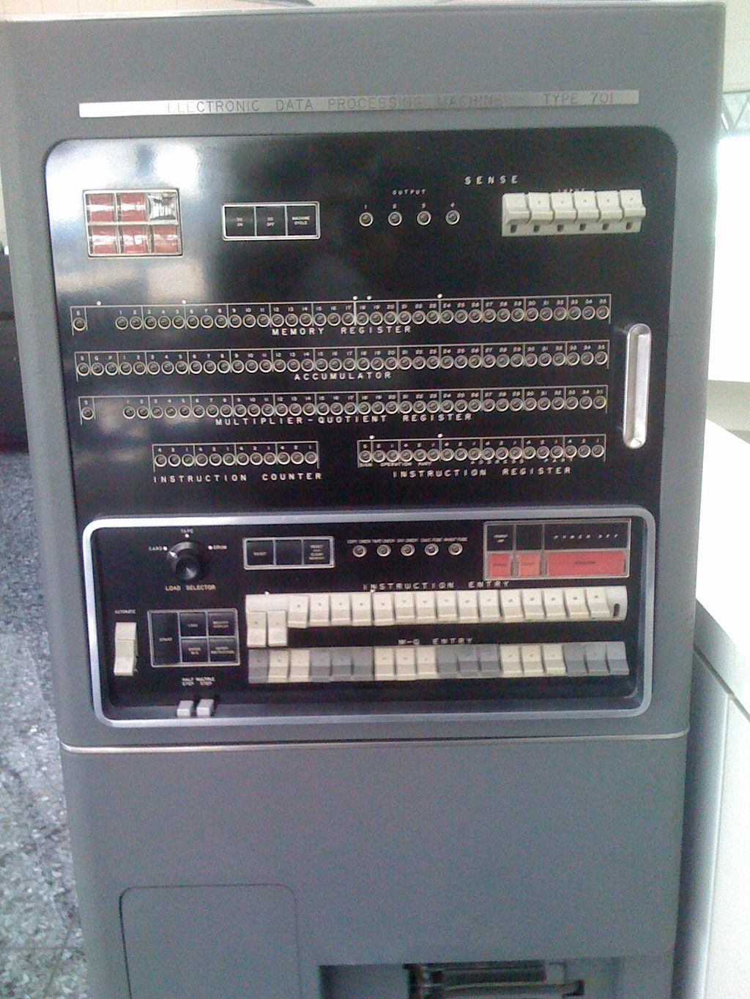
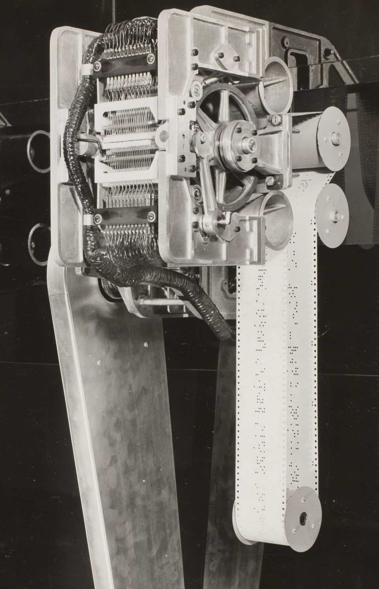
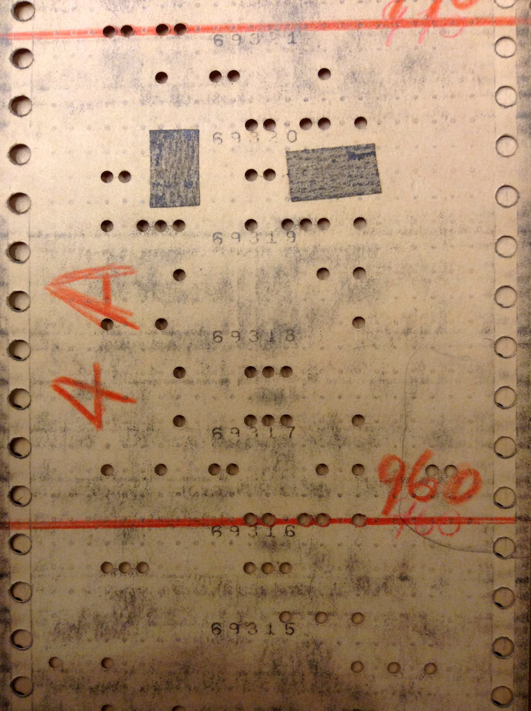
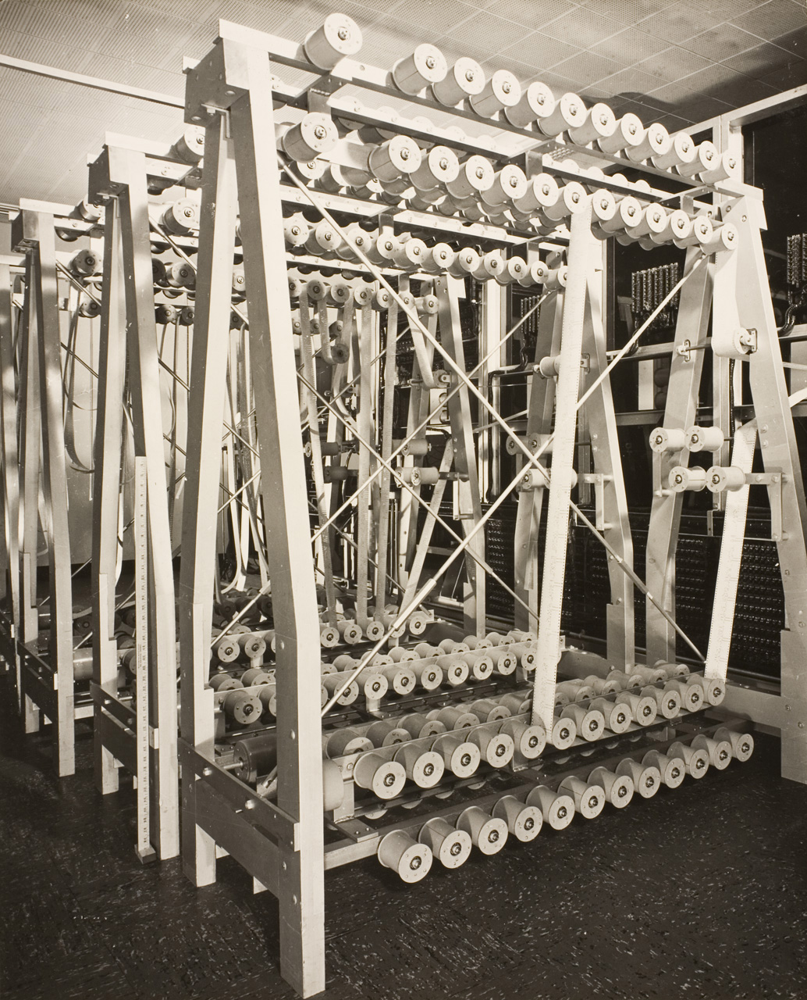
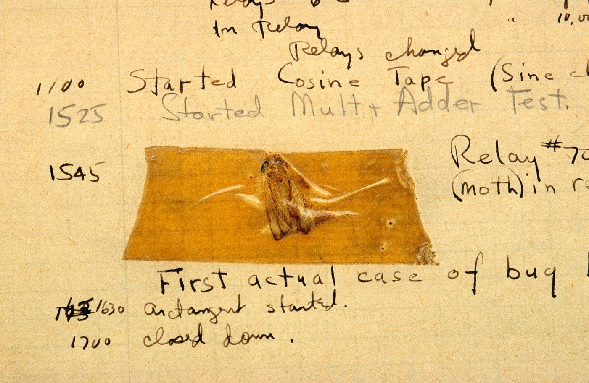
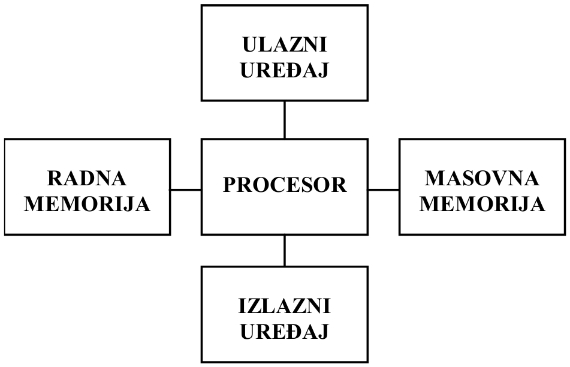

=====================================
Arhitektura računara oko 1950. godine
=====================================

MARK I (1944. godina)
=====================

IBM i Harvard univerzitet su zajedno napravili MARK I, prvi
elektro-**mehanički** računar opšte namene.

MARK I: značaj
--------------

Zajedno sa svojim naslednicima (MARK II, III i IV) posedovao je dva međusobno
odvojena tipa radne memorije, zasebno za programe i za podatke.

Ovaj pristup je nazvan **harvardska arhitektura računara**.

MARK I: zanimljivosti
---------------------

#. korišćen za simulacije implozija prve atomske bombe (tzv. Menhetn projekat)
#. bio je preko 60.000.000.000 puta sporiji od današnjih mobilnih telefona

ENIAC (1946. godina)
====================

Istraživačka grupa sa Pensilvanija univerziteta napravila je ENIAC (Electronic
Numerical Integrator And Calculator), prvi **elektronski** računar opšte
namene.

ENIAC: značaj
-------------

#. bio je hiljadama puta brži od tadašnjih elektro-mehaničkih računara
#. posedovao je radnu memoriju **samo za podatke**
#. programi su bili **ručno zadavani** na komandnoj tabli, putem prekidača i
   prespajanja kablova

ENIAC: zanimljivosti
--------------------

#. bio je namenjen za proračune balističkih putanja projektila i simulacije
   eksplozija termonuklearnih bombi
#. izrodio je prvu generaciju programerki, tehničke profesije su ženama do tad
   uglavnom bile van domašaja
#. popularizovao je upotrebu Monte Karlo metode i teorije haosa, npr. kako sa
   viršlama doći do :math:`\pi`?

EDVAC (1949. godina)
====================

ENIAC istraživačka grupa je u saradnji sa John von Neumann-om napravila
duhovnog naslednika, EDVAC (Electronic Discrete Variable Automatic Computer).

EDVAC: značaj
-------------

Za razliku od svojih prethodnika EDVAC je posedovao samo jedan tip radne
memorije, u kojem su se skladištili zajedno i programi i podaci.

Ovaj pristup je nazvan **von Neumann arhitektura računara** i vremenom je
postao dominantan pristup u razvoju računara (zašto?).

UNIVAC I (1951. godina)
=======================

Isporučen prvi **komercijalni** elektronski računar opšte namene, UNIVAC I
(UNIVersal Automatic Computer).

UNIVAC I: zanimljivosti
-----------------------

#. korišćen za prvo (i uspešno) računarsko predviđanje rezultata (Američkih)
   predsedničkih izbora
#. prvi računar za koji su prikazivane TV reklame:
   https://youtube.com/watch?v=FMXT4f8C63A
#. TV snimak razvoja programa za UNIVAC:
   https://youtube.com/watch?v=j2fURxbdIZs&t=514

IBM 701 (1953. godina)
======================

IBM (International Business Machines corporation) isporučio je svoj prvi
elektronski računar opšte namene, IBM 701 Electronic Data Processing Machine.

IBM 701: zanimljivosti
----------------------

#. IBM je bio tada vodeći proizvođač poslovne opreme, osnovan 1896. godine
#. rodonačelnik M/CaaS (Metal/Computer as a Service) biznisa, pošto se IBM 701
   mogao iznajmljivati ali ne i kupiti (u čemu je razlika?)
#. IBM je ovim računarom započeo svoju višedecenijsku dominaciju na tržištu

Nastanak računarskih termina
============================

U ovom periodu uvedeni su u upotrebu neki od danas standardnih
računarskih termina...

Petlja (eng. loop)
------------------

Zakrpa (eng. patch)
-------------------

Biblioteka programa (eng. programming library)
----------------------------------------------

Greška (eng. bug)
-----------------

Arhitektura računara u ovom periodu
===================================

IBM 701 i UNIVAC I se smatraju predstavnicima prve generacije računara.

Tipična organizacija računara
-----------------------------

Zasebne magistrale (upravljačke, adresne, linije podataka) povezuju procesor sa
različitim delovima računara. Procesor učestvuje **u svim razmenama podataka**,
između bilo koja dva dela računara.

Tehnologija izrade računara
---------------------------

- procesor: elektronske cevi
- radna memorija: elektrostatička (katodne cevi)
- masovna memorija: magnetne trake
- ulazni uređaji: čitači bušenih traka/kartica
- izlazni uređaji: bušači traka/kartica, štampači

Problemi adresiranja
--------------------

Postojala su dva međusobno odvojena adresna prostora: zasebno za radnu memoriju
i za ulazne/izlazne uređaje.

Adresa ``0xDEADC0DE`` je mogla istovremeno da pokazuje na memorijsku lokaciju,
ali i izlazni uređaj (npr. štampač).

Stoga je procesor imao dva odvojena skupa naredbi za adresiranje, prenos i
obradu podataka - u zavisnosti od željenog adresnog prostora.

Za šta su korišćeni?
--------------------

Prevashodna namena su bili složeni numerički proračuni i simulacije za vojne, a
tek kasnije i mirnodopske potrebe.

Ali uprkos tome ovi računari ipak nemaju podršku za:

- aritmetiku pokretne tačke
- potprograme
- adresiranje/obradu elemenata niza (kako onda raditi sa matricama?)

Kako su korišćeni?
------------------

Interaktivni način rada, praćenje i upravljanje toka izvršavanja programa putem
komandne table.

Postepena evolucija u načinu i lakoći programiranja:

#. putem prekidača i direktnog prespajanja kablova
#. mašinski jezik, učitavanjem sa ulaznih uređaja
#. asemblerski jezik i prve naznake kompajlera

Koliko su bili efikasni?
------------------------

Računar je provodio većinu vremena u stanju čekanja, jer:

#. procesor učestvuje u svim razmenama podataka, između bilo koja dva dela
   računara
#. postoji ogromna razlika u brzini rada različitih delova računara: procesor
   >> radna memorija >> masovna memorija >> ulazni/izlazni uređaji

Već tada se koristila najbrža tehnologija za procesor, a znatno
sporija/jeftinija za radnu i masovnu memoriju.

Mane računara iz ovog perioda
=============================

Veoma slaba iskorišćenost računarskih resursa, uzroci:

- interaktivni način rada, programer ispravlja greške dok računar stoji i čeka
- samo-modifikujuća priroda programa, što zahteva ponovna učitavanja za svako
  naredno izvršavanje
- procesor učestvuje u svim razmenama podataka, između bilo koja dva dela
  računara - a svi ostali delovi su **po nekoliko redova veličine sporiji**
  od procesora

Izvori slika
============

- \M. Hajduković, Ž. Živanov: Arhitektura računara, 2019.
- `<https://commons.wikimedia.org/wiki/File:Harvard_Mark_I_Computer_-_Left_Segment.jpg>`_
- `<https://commons.wikimedia.org/wiki/File:Eniac.jpg>`_
- `<https://commons.wikimedia.org/wiki/File:Edvac.jpg>`_
- `<https://commons.wikimedia.org/wiki/File:Univac_I_at_Census_Bureau_with_two_operators.jpg>`_
- `<https://commons.wikimedia.org/wiki/File:IBM_701console.jpg>`_
- http://sites.harvard.edu/~chsi/markone/language.html
