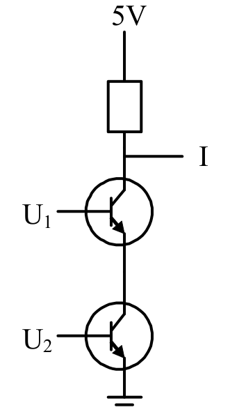
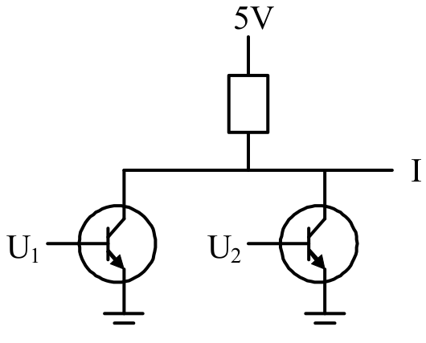
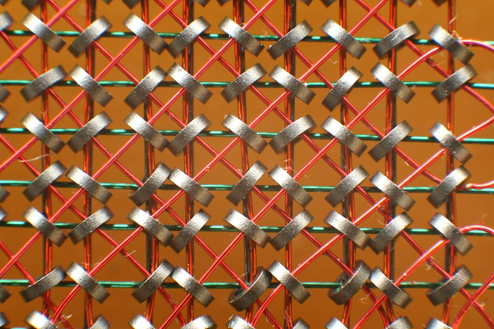
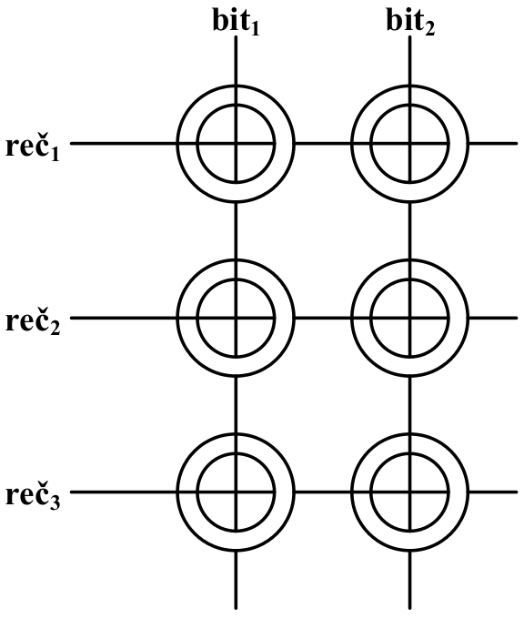
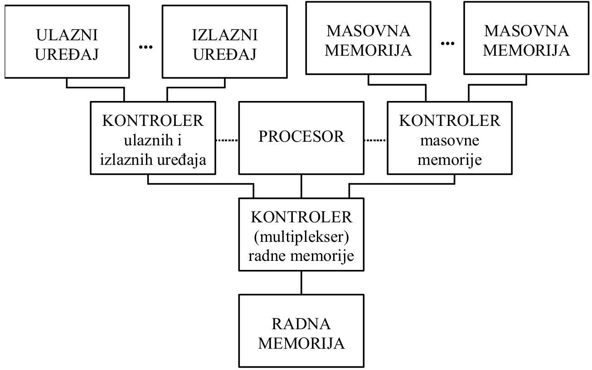
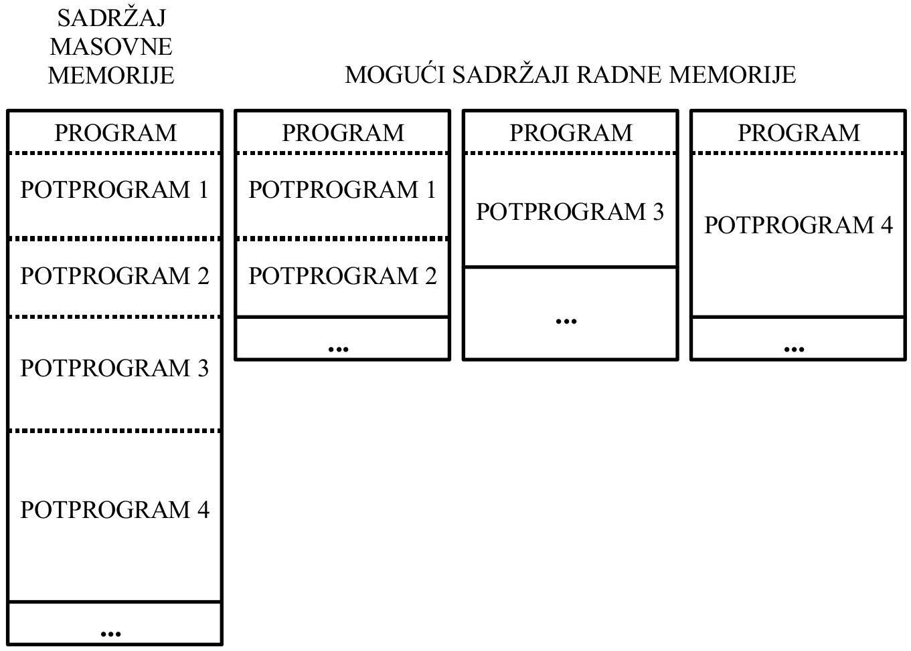

=====================================
Arhitektura računara oko 1960. godine
=====================================

Tehnologija izrade računara
===========================

- procesor: **diskretni poluprovodnici** (u prethodnoj generaciji su korišćene
  elektronske cevi)
- radna memorija: **magnetne jezgrice** (u prethodnoj generaciji je korišćena
  elektrostatička memorija)
- masovna memorija: magnetne trake
- ulazni uređaji: čitači bušenih traka/kartica
- izlazni uređaji: bušači traka/kartica, štampači

Diskretni poluprovodnici (tranzistori)
--------------------------------------

Značajne prednosti u odnosu na elektronske cevi: niža cena, manje dimenzije,
brže izvršavanje, pouzdaniji rad, manja potrošnja energije i toplotno zračenje.

Korišćeni za implementaciju univerzalnih logičkih kola: ``NAND`` i ``NOR``.
Zašto se ova kola smatraju **univerzalnim**?

Logičko kolo ``NAND`` (``NOT AND``)
-----------------------------------

::

    U1  U2    I

    0V  0V    5V
    0V  5V    5V
    5V  0V    5V
    5V  5V    0V

Logičko kolo ``NOR`` (``NOT OR``)
---------------------------------

::

    U1  U2   I

    0V  0V   5V
    0V  5V   0V
    5V  0V   0V
    5V  5V   0V

Magnetne jezgrice
-----------------

Značajne prednosti u odnosu na elektrostatičku memoriju: veći kapacitet, niža
cena, manje dimenzije i pouzdaniji rad. Za jedan bit potrebna je jedna magnetna
jezgrica.

Magnetne jezgrice: princip rada
-------------------------------

Smer magnetnog polja određuje vrednost bita:

- čitanje: dovesti punu struju magnetizacije na reč\ :sub:`1`, pa očitati
  indukovan napon na linijama bit\ :sub:`1` i bit\ :sub:`2`

- pisanje: dovesti polovičnu struju  magnetizacije na reč\ :sub:`1`, pa dovesti
  polovičnu struju i na bit\ :sub:`1` i na bit\ :sub:`2`

Magnetne jezgrice: mane
-----------------------

- čitanje memorijske lokacije je **destruktivno**, zbog potencijalne promene
  magnetnog polja
- nezanemarljivo **vreme za pristup lokaciji**, koje predstavlja najkraći
  interval između zahteva za pristupom memorijskoj lokaciji i očitavanja
  sadržaja
- nezanemarljivo **vreme ciklusa**, koje predstavlja najkraći interval između
  uzastopnih pristupa lokaciji. Traje duže od vremena za pristup lokaciji
  (zašto?)

Organizacija računara u ovom periodu
====================================

IBM 1401 i IBM 7094 se smatraju predstavnicima druge generacije računara.
Glavno unapređenje u odnosu na prethodnu generaciju je uvođenje kontrolera:

Kontroleri
----------

Kontroleri su specijalizovani uređaji za upravljanje drugim delovima
računara. U zavisnosti od uloge, mogu biti:

- jednostavni, prosto multipleksiranje linija: kontroler radne memorije
- složeni, tzv. procesori posebne namene: kontroler masovne memorije, kontroler
  ulaznih/izlaznih uređaja

Složeni kontroleri: procesori posebne namene
--------------------------------------------

Procesori posebne namene imaju ravnopravan pristup radnoj memoriji računara,
gde procesor opšte namene može da im postavi namenski kontrolerski program.

Kontroleri su podržavali veoma ograničen skup naredbi:

#. naredbe za rukovanje njemu podređenim uređajima (npr. premotaj magnetnu traku)
#. naredbe za prenos podataka između radne memorije i njemu podređenih uređaja
#. upravljačke naredbe

Kontroleri: zašto?
------------------

Procesor više ne mora **direktno** da učestvuje u svim razmenama podataka
između drugih delova računara.

Može se postići bolja iskorišćenost računarskih resursa, pošto su svi ostali
delovi računara **po nekoliko redova veličine sporiji** od procesora.

Kontroleri su postali mogući zbog značajnog sniženja cena procesnih elemenata,
prouzrokovanog prelaskom sa elektronskih cevi na diskretne poluprovodnike.

Arhitektura naredbi u ovom periodu
==================================

Zavisi od prevashodne namene računara, npr. IBM 1401 korišćen je za (suštinski
jednostavniju) poslovnu obradu podataka - te je posedovao sličan pristup (i
ograničenja) kao računari u prethodnoj generaciji.

Sa druge strane, namena računara kao što je IBM 7094 su bili složeni numerički
proračuni, te je dodatno podržavao:

- aritmetiku pokretne tačke
- potprograme
- indeksno adresiranje/obradu elemenata niza

Broj operanada u mašinskoj naredbi
----------------------------------

Zavisno od računara, broj adresa je varirao od 0 do 3::

    ADD A, B, C      A   +     B     --> C      # 3 operanda
    ADD A, B         A   +     B     --> B      # 2 operanda
    ADD A            A   +    ACC    --> ACC    # 1 operand + akumulator
    ADD            STACK + STACK[-1] --> STACK  # 0 operanda, samo stek

Za jedno-adresne računare (npr. IBM 7094) vezan je pojam **akumulatorske
arhitekture**, a za nula-adresne računare (npr. Burroughs B5000) vezivan pojam
**stek arhitekture**.

Jedno-adresni računari su obavezno sadržali dodatne naredbe za rukovanje
akumulatorima, tj. stekom u slučaju nula-adresnih računara.

Da li su bolje naredbe sa manje operanada?
------------------------------------------

Ako se koriste mašinske naredbe sa **manje** operanada pojedinačna naredba
zauzima **manje** radne memorije, ali je potreban **veći** broj mašinskih
naredbi u programu:

#. smesti ``A`` na stek
#. smesti ``B`` na stek
#. saberi
#. smesti rezultat sa steka nazad u ``B``

Ili su bolje naredbe sa više operanada?
---------------------------------------

Ako se koriste mašinske naredbe sa **više** operanada pojedinačna naredba
zauzima **više** radne memorije, ali je potreban **manji** broj mašinskih
naredbi u programu:

#. ``ADD A, B``

Koji format naredbi je bolji, i zašto?

Osobine računara u ovom periodu
===============================

U ovom periodu uvedene su u upotrebu preteče nekih od danas standardnih
računarskih koncepata:

- programski jezici visokog nivoa
- kompajleri
- upravljanje memorijskom hijerarhijom, između radne i masovne memorije
- operativni sistemi

Programski jezici visokog nivoa
-------------------------------

U ovom periodu pojavili su se prvi programski jezici visokog nivoa, koji se i
danas koriste (u određenom obimu):

#. FORTRAN (FORmula TRANslation), prevashodno namenjen za složene numeričke
   proračune
#. COBOL (COmmon Business Oriented Language), prevashodno namenjen za poslovnu
   obradu podataka
#. LISP (LISt Processor), prevashodno namenjen za simboličke proračune *(nadam
   (se (da (volite (zagrade)))*

Programski jezici visokog nivoa: kompajleri
-------------------------------------------

Paralelno sa njima su se pojavili i prvi kompajleri, koji su programe napisane
u programskim jezicima visokog nivoa **automatski** prevodili u odgovarajući
mašinski oblik.

Programski jezici visokog nivoa: prednosti
------------------------------------------

- uopšteni model računara, programiranje bez poznavanja detalja funkcionisanja
- prenosivost programa između različitih modela i arhitektura računara, da li
  je programski jezik C univerzalni portabilni "asembler"?
- formiranje biblioteka često korišćenih potprograma

Programski jezici visokog nivoa: mane
-------------------------------------

Programiranje u jezicima visokog nivoa ipak ima neke mane u odnosu na direktnu
upotrebu mašinskog jezika:

- **uopšteni model računara, programiranje bez poznavanja detalja
  funkcionisanja** (Crysis vs. Minecraft grafika i performanse)
- potencijalno slabija iskorišćenost procesora (ručna vs. automatska
  optimizacija)
- potencijalno veći utrošak radne memorije (ručna vs. automatska optimizacija)
- kvalitet i pouzdanost kompajlera, u početku

Preklapanje delova programa
---------------------------

Računari iz ovog perioda poseduju veoma malu količinu radne memorije, u koju je
mogao da se smesti samo mali deo izvršavanog programa i obrađivanih podataka.

Stoga su programeri morali da osmisle odgovarajuću tehniku za prebacivanje
trenutno "(ne)aktivnih" delova radne memorije sa/na masovnu memoriju, po
potrebi.

Preklapanje delova programa: memorijska hijerarhija
---------------------------------------------------

Radna i masovna memorija su suštinski tretirani kao dva zasebna nivoa
unificirane memorijske hijerarhije, gde su programeri **ručno** prebacivali
delove svojih programa sa jednog nivoa memorijske hijerarhije na drugi:

Rani operativni sistemi
-----------------------

Programiranje u jezicima visokog nivoa ipak ima neke mane u odnosu na direktnu
upotrebu mašinskog jezika: **uopšteni model računara, programiranje bez
poznavanja detalja funkcionisanja**, ...

Ako mi programiramo bez poznavanja detalja funkcionisanja računara, ko (i kako)
onda upravlja računarom i njegovim delovima?

Rani operativni sistemi: princip rada
-------------------------------------

#. programer priprema program na bušenim karticama
#. programer predaje bušene kartice operateru računara
#. operater pušta sve pripremljene programe računaru na izvršavanje, jedan po
   jedan
#. operativni sistem računara automatski učitava program sa bušenih kartica,
   kompajlira ga u mašinski oblik, pokreće izvršavanje i štampa rezultate rada
#. operater vraća odštampane rezultate programeru
#. programer analizira dobijene rezultate
#. programer ispravlja svoje greške u programu
#. ``GOTO 1``

Ova beskonačna petlja nije slučajna, zašto? :)

Rani operativni sistemi: posledice
----------------------------------

- potencijalno bolja iskorišćenost procesora u odnosu na prethodnu generaciju
  računara, pošto računar može biti zaposlen drugim zadacima dok pojedinačni
  programeri ispravljaju greške u svojim programima
- nema više direktnog programiranja na samom računaru, nestanak interaktivnog
  rada
- **veoma** dug proces debugovanja (zašto?), dok program prvi put ne proradi
  kako treba
- ako ima sto programera, a samo jedan računar - kada će moj program doći na
  red?
- a šta se dešava ako (bar) jedan tuđi program zahteva dane (ili nedelje)
  računarskog vremena?

Mane računara iz ovog perioda
=============================

- neiskorišćenost potencijalnog paralelizma među procesorima, pošto procesor
  opšte namene stoji i čeka dok procesor posebne namene ne završi izvršavanje
  zadatog mu kontrolerskog programa
- isuviše komplikovano (a ipak neophodno) ručno upravljanje memorijskom
  hijerarhijom, između radne i masovne memorije
- potencijalno slabija iskorišćenost procesora i veći utrošak radne memorije,
  zbog komoditeta nemoranja poznavanja detalja funkcionisanja računara,
  kvaliteta prvih kompajlera i automatski optimizovanog koda
- ozbiljno smanjena produktivnost programera (zašto?)

Izvori slika
============

- \M. Hajduković, Ž. Živanov: Arhitektura računara, 2019.
- `<https://commons.wikimedia.org/wiki/File:KL_Kernspeicher_Makro_1.jpg>`_
